# Persiapan Lingkungan Praktikum

## Prasyarat

Pastikan kalian sudah memasang virtualbox atau vmware atau vm manager lain pada sistem operasi kalian.

## Unduh Linux Box dari Osboxes

Download image ubuntu dengan DE yang sesuai dengan kemampuan laptop.

Jika RAM kurang dari 8 GB, bisa mencoba menggunakan [Xubuntu](https://www.osboxes.org/xubuntu/) atau [Lubuntu](https://www.osboxes.org/lubuntu/). Jika RAM diatas 8 GB, bisa menggunakan [Ubuntu](https://www.osboxes.org/ubuntu/) GNOME Biasa. Unduh flavor ubuntu yang sesuai di versi 20.04. Box lainnya bisa dilihat di laman resmi [osboxes](https://www.osboxes.org/virtualbox-images/), untuk praktikum KI disarankan memakai Ubuntu GNOME atau Xubuntu. Untuk yang menggunakan vm manager lain bisa menyesuaikan.

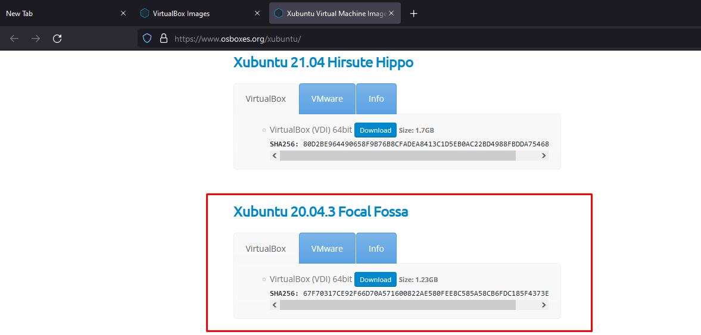

## Pembuatan Mesin Virtual Baru

Klik ikon New,

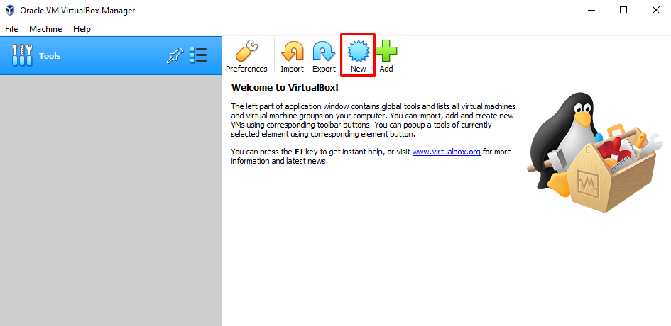

Sesuaikan nama dan folder tempat penyimpanan data mesin virtual dan tipe serta jenisnya.

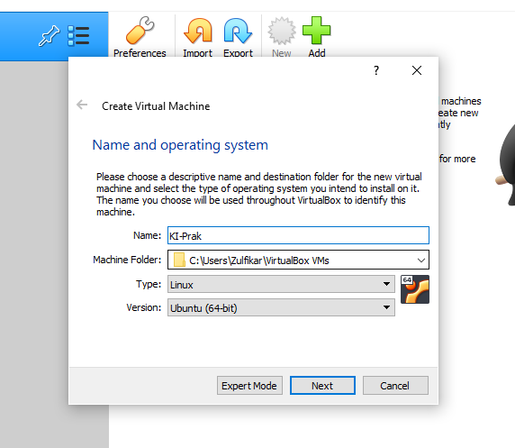

Alokasikan memori RAM untuk mesin virtual. Untuk Xubuntu, minimal alokasi memori RAM adalah 512 MB namun, disarankan untuk melebihinya seperti di 1024 MB atau 1536 MB. Untuk Ubuntu GNOME, disarankan untuk mengalokasikan memori minimal 4096 MB.

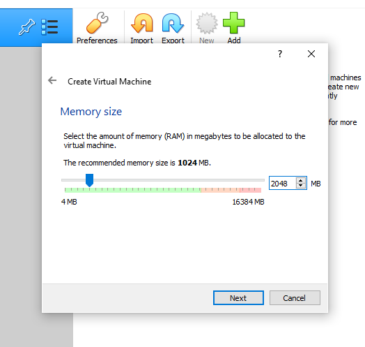

> Jika menggunakan xubuntu, untuk beberapa praktikum yang menggunakan aplikasi berbasis java (ghidra) mungkin tidak bisa dijalankan. Solusinya adalah menjalankan ghidra di OS Host secara langsung.

Klik ikon folder untuk membuka file yang telah didownload tadi.

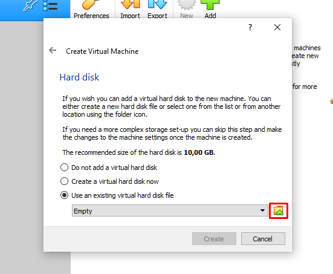

Klik Add,

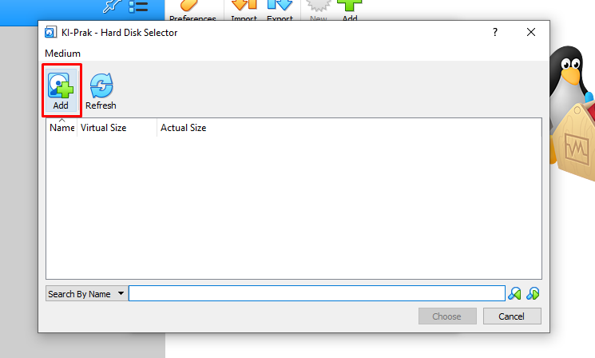

Arahkan ke tempat di mana kalian mengekstrak file vdi dari box yang kalian download pada osboxes. Klik open.

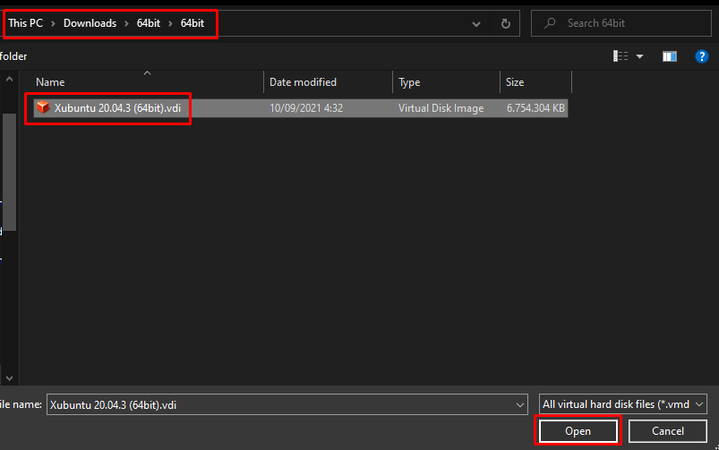

Klik *Choose* untuk memilih file yang kita tambahkan tadi.

> Jangan khawatir dengan virtual size yang sangat besar. Ukuran tersebut tidak akan dialokasikan langsung ke penyimpanan, namun dialokasikan secara dinamis sesuai dengan total ukuran file-file yang ada di mesin virtual.

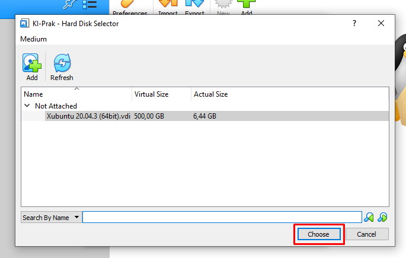

Klik create untuk membuat mesin virtual.

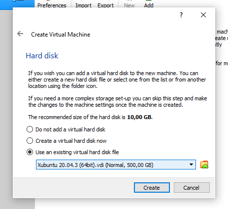

Klik start untuk memulai Mesin virtual

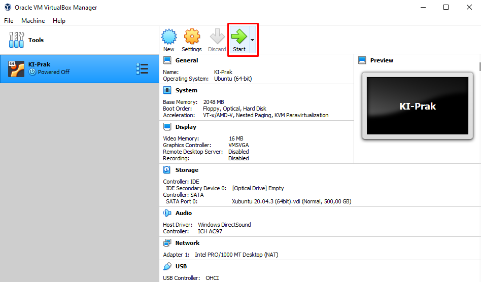

Login menggunakan password default osboxes, yaitu `osboxes.org` dan Mesin Virtual sudah jadi.

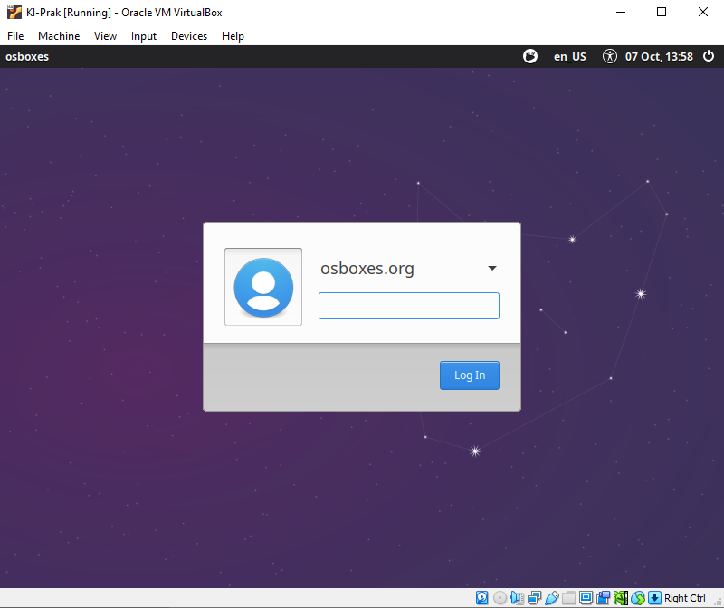

## [Optional] Setup User Baru dan Ubah hostname

Tambahkan user baru dengan username bebas

```bash
sudo adduser username
```

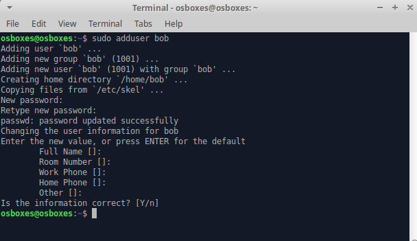

Tambahkan ke grup sudo agar bisa menjalankan command sudo

```bash
sudo usermod -aG sudo bob
```

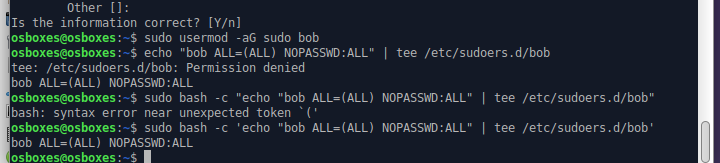

Jalankan command berikut untuk membuat user baru tidak perlu memasukkan password setiap kali ingin menjalankan sudo.

```bash
sudo bash -c 'echo "username ALL=(ALL)" '
```

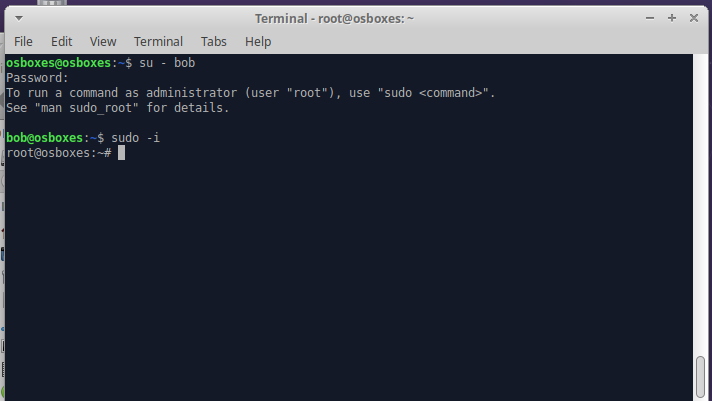

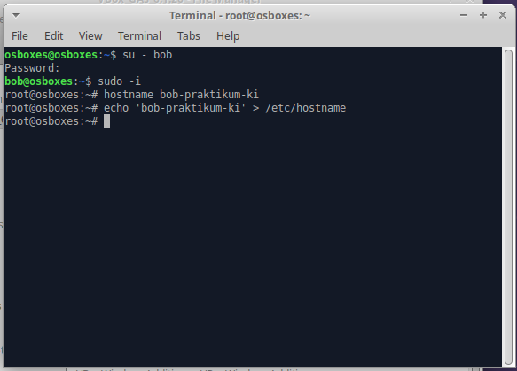

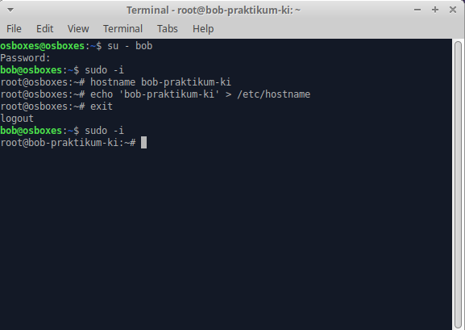

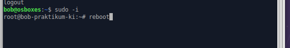

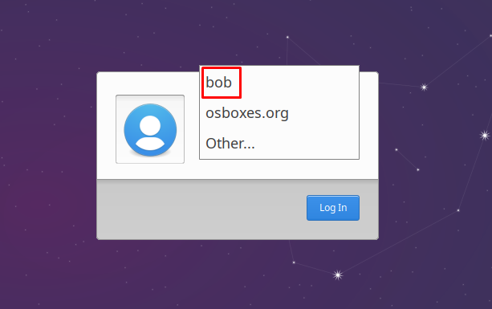

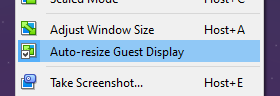

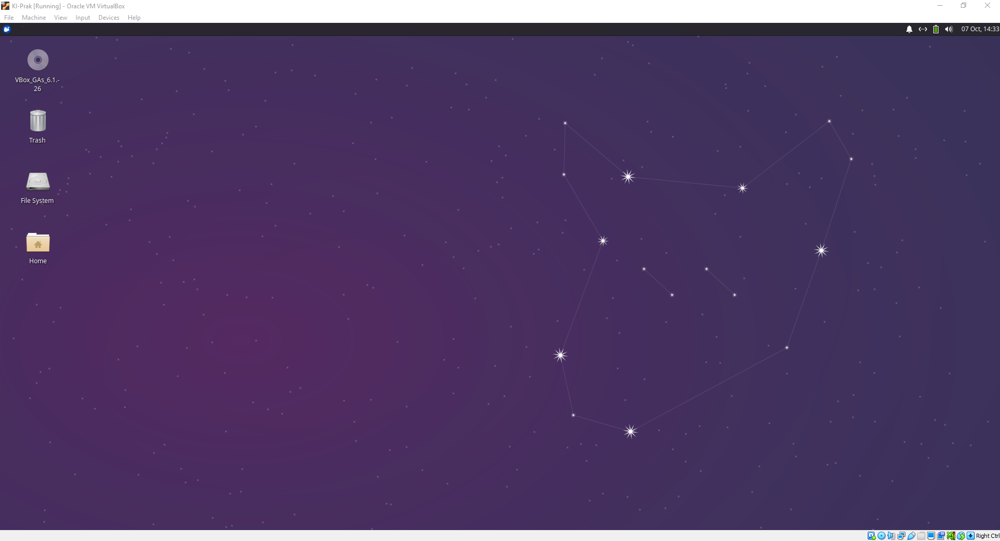

