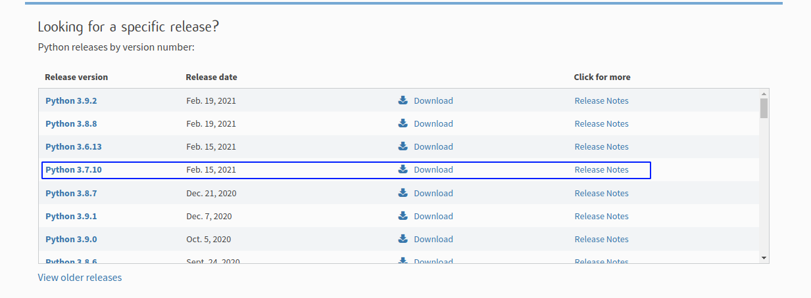

# Instalasi Python

Untuk modul KI ini, sebaiknya menggunakan versi python 3.7 dan python 2.7.9 (opsional).

## Windows

Kunjungi [tautan berikut](https://www.python.org/downloads/), pilih versi yang sesuai dan klik download.



## MacOS

Dapat mengunduh langsung seperti pada windows, atau menggunakan [homebrew package manager](https://brew.sh/).
```bash
brew install python
```

## Linux

Unduh menggunakan package manager yang sesuai,

Debian-based (Ubuntu, Kali, Mint, Parrot),
```bash
sudo apt update
sudo apt install python2 python3
```

Arch-based (Manjaro, Garuda)
```bash
sudo pacman -Sy python2 python
```