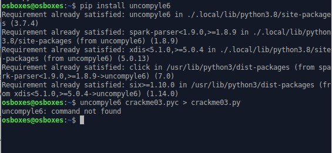

# Uncompyle6 Not Found

## Samples

Sample *screenshot* dari error,




## Penyebab Umum

- `PATH` letak binary uncompyle6 belum ditambahkan pada sistem
- uncompyle6 belum terinstall
- gagal melakukan instalasi uncompyle6
- versi python pada komputer tidak didukung library

### Penyelesaian 1

Tambahkan letak binary uncompyle6 pada *environment variable* `PATH` sistem.

Pertama, ketahui letak binary dari uncompyle6 (ada saat pertama melakukan instalasi melalui pip). Secara umum, jika menggunakan ubuntu, lokasi binnary dari library python yang dipasang melalui pip akan terletak di `/home/USER/.local/bin`.


Kalian bisa mencoba melihat path apa saja yang terdaftar di variabel `PATH` linux kalian dengan menggunakan perintah `echo $PATH`


Untuk menambah direktori tersebut ke `PATH`, kalian bisa mengubah file `~/.bashrc` (jika menggunakan bash, sesuaikan jika menggunakan selain itu) dengan menggunakan teks editor GUI (gedit, kate, VSCode, dll.) dan menambahkan line berikut,

``` bash
...
export PATH=$PATH:/home/$USER/.local/bin:$PATH
...
```

Alternatif lain, jika kalian ingin langsung menggunakan command line dapat menjalankan perintah berikut,

```bash
echo "export PATH=\$PATH:/home/\$USER/.local/bin" >> ~/.bashrc
```

Contoh hasil akhir dari file `~/.bashrc` dapat kalian lihat di bawah,


Silahkan tutup dan buka kembali terminal kalian atau melakukan logout dan login kembali ke linux kalian dan uncompyle6 dapat dijalankan.


### Penyelesaian 2

Kalian dapat melakukan instalasi ulang package `python3` atau `pip`. Pastikan kalian melakukan instalasi package `python3-pip` jika kalian menggunakan python versi 3.

```bash
sudo apt install python3-pip
pip3 install uncompyle6
```

### Penyelesaian 3

Versi python yang disarankan untuk modul ini tertanggal 29 September 2021 adalah versi 3.7 atau 3.8 . Silahkan melakukan downgrade atau menggunakan [`pyenv`](https://github.com/pyenv/pyenv) untuk memungkinkan memasang versi python lebih dari 1 pada 1 komputer.