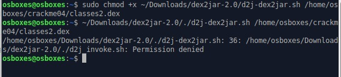
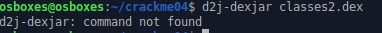

# Instalasi dex2jar

## Samples

Sample *screenshot* dari error,





## Penyebab Umum

- Belum melakukan instalasi dex2jar
- Instalasi tidak selesai
- Typo pada penulisan perintah

### Penyelesaian

Sebelum instalasi, pastikan kalian telah memiliki java runtime environment versi 8+. Kalian bisa memeriksanya dengan perintah `java --version`. Instalasi java dapat dilakukan dengan menggunakan perintah,

```bash
sudo apt install openjdk-11-jre
```

Instalasi dex2jar pada ubuntu (20.04) dapat dilakukan dengan perintah berikut,

Pertama, download rilis dex-tools di github atau bisa menggunakan perintah `wget`,

```bash
wget https://github.com/pxb1988/dex2jar/releases/download/2.0/dex-tools-2.0.zip
```


Extract file dex-tools-2.0.zip menggunakan `unzip`

```bash
unzip dex-tools-2.0.zip
```


Tambahkan permission eksekusi untuk semua file yang ada di direktori `dex2jar-2.0`.

```bash
chmod -R +x dex2jar-2.0/
```

Jalankan d2j-dex2jar.sh pada direktori dex2jar-2.0 dan tambah argumen path ke file classes2.dex.

```bash
./dex2jar-2.0/d2j-dex2jar.sh ./android_app/classes2.dex
```

