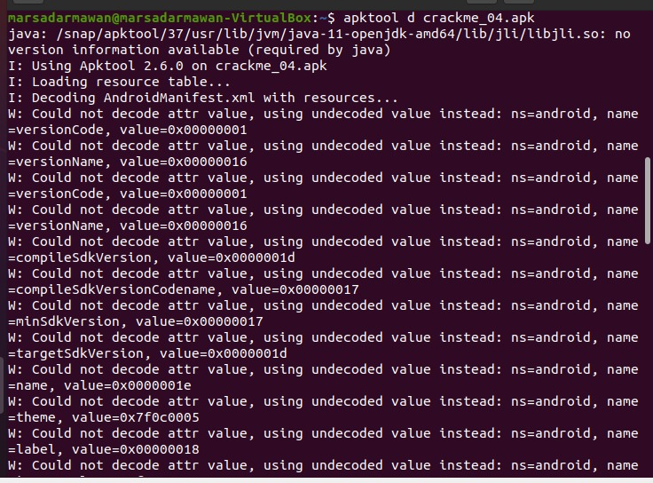
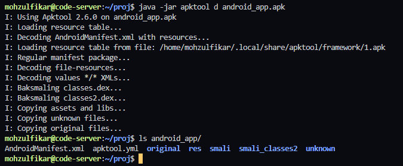

# Instalasi Apktool

## Samples

Sample *screenshot* dari error,



## Penyebab Umum

- Versi Java tidak mendukung apktool yang dipasang
- Instalasi apktool versi 2.6.0 melalui `apt`

### Penyelesaian

Sebelum instalasi, pastikan kalian telah memiliki java runtime environment versi 8+. Kalian bisa memeriksanya dengan perintah `java --version`. Instalasi java dapat dilakukan dengan menggunakan perintah,

```bash
sudo apt install openjdk-11-jre
```


Instalasi apktool pada ubuntu (20.04) dapat dilakukan dengan perintah berikut,

Pertama, download rilis apktool di github atau bisa menggunakan perintah `wget`,

```bash
wget -O apktool https://github.com/iBotPeaches/Apktool/releases/download/v2.6.0/apktool_2.6.0.jar
```

Jalankan apktool menambahkan perintah `java -jar` sebelum `apktool d ...` seperti berikut,

```bash
java -jar apktool d android_app.apk
```



> Jika masih terdapat error, silahkan dibaca kembali panduan ini atau kalian bisa mecoba lagi dengan mengunduh versi sebelumnya (2.5.0, 2.4.1, dst.).
