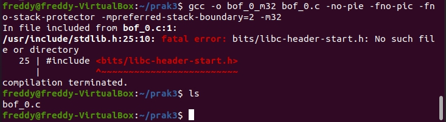

# GCC Error

## Fatal error on bits/libc-header no such file

Contoh error,


Penyebab umum,

- Library GCC untuk kompilasi 32 bit belum terinstall
- Menggunakan WSL versi 1 ([Upgrade WSL](https://stackoverflow.com/questions/61300194/does-wsl-2-really-support-32-bit-program))

Penyelesaian untuk penyebab pertama,<br>
Install gcc multilib menggunakan perintah sbb.
``` bash
sudo apt update && sudo apt install gcc-multilib
```