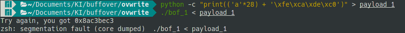

# Python Error

## Python error payload tidak sesuai ekspektasi

Contoh error,


Penyebab umum,

- Versi python tidak sesuai dengan petunjuk
- Menggunakan python 3 untuk membuat payload

Penyelesaian,
Periksa versi python menggunakan,
```bash
python -V
```
Jika versi python yang dicetak 3 maka jalankan ulang perintah dengan menggunakan prefix `python2`
```bash
python2 -c ...
```