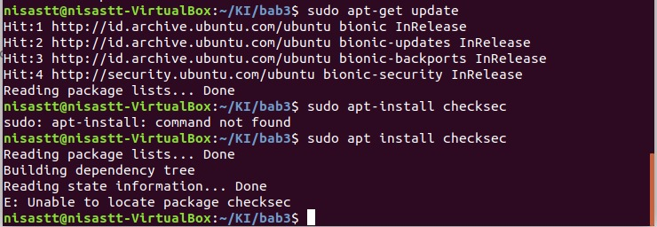

# Checksec Unable to Locate Package

## Gagal melakukan instalasi checksec via apt

Contoh error,



Penyebab umum,

- Belum melakukan update repository
- Repository upstream belum diperbarui/sedang tidak tersedia
- Error lainnya

Penyelesaian,

Checksec merupakan sebuah script bash yang bisa di unduh dan dijalankan layaknya script biasa. Unduh checksec dari repository github.

```bash
wget https://raw.githubusercontent.com/slimm609/checksec.sh/master/checksec
```

Tambahkan permission untuk eksekusi checksec

```bash
chmod +x checksec
```

Jalankan checksec

```bash
./checksec --file=nama_file
```
