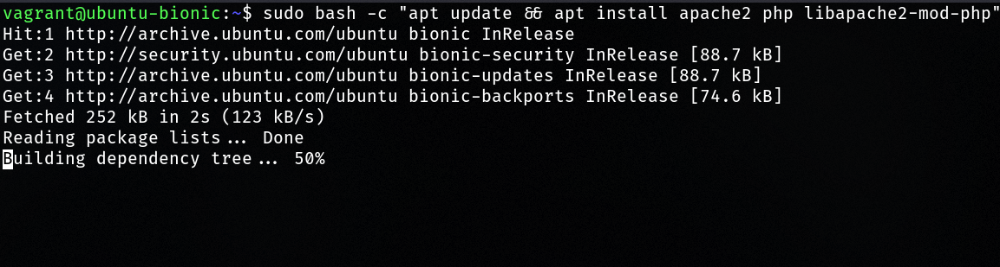
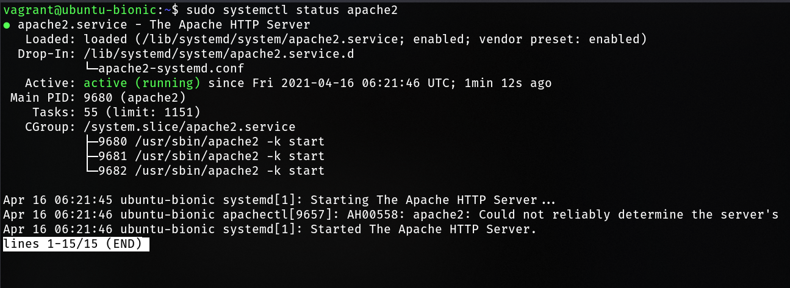

# Apache PHP installation

## Install Apache2 dan PHP pada Ubuntu

Instalasi apache2 dan php dapat dilakukan dengan perintah berikut,

```bash
sudo bash -c "apt update && apt install apache2 php libapache2-mod-php"
```



Pastikan apache sudah berjalan dengan perintah,

```bash
sudo systemctl status apache2
```



Jika belum memiliki status *running*, jalankan dengan perintah berikut,

```bash
sudo systemctl start apache2
```

Untuk membuat apache selalu berjalan ketika komputer pertama kali dinyalakan, jalankan perintah berikut.

```bash
sudo systemctl enable apache2
```
